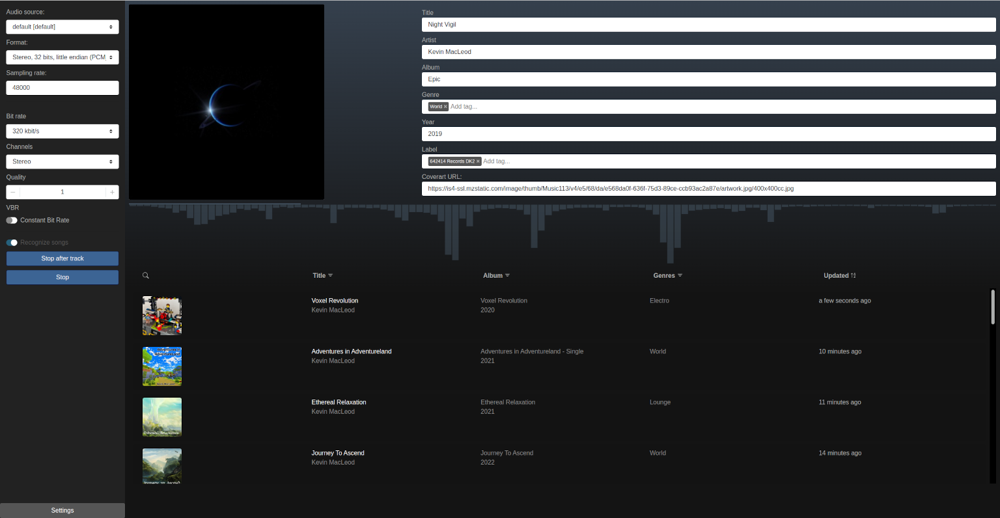

# Audio Dragon

AudioDragon is an application to automatically record, tag and save audio as high-quality MP3 files.

> This project is currently under development. It contains bugs and may not be usable at all on some machines.
> Please do not report issues yet.

This software application allows to record arbitrary audio. Make sure you are allowed to create copies of any music and/or other media before recording it with this application.
Music and other media may be protected by copyright law and creating copies may be not allowed by contract or applicable law.
This application is intended for demonstration purposes only. Permission for using the software is only granted for lawful purposes. Do not use this application to create copies of media protected by copyright!